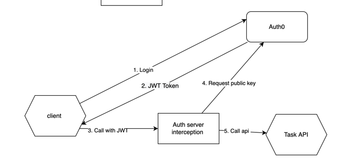

# What is about?
That is a test play around project. It covers: 

- gRPC service authorization with Auth0
- ...

# Top level arch
## Authorization


# Development
## pre 

- Go 18 or newer
- protobuf
- protoc-gen-go-grpc
- protoc-gen-go-grpc
Use commands to install
```shell
brew install protobuf
brew install protoc-gen-go-grpc
brew install protoc-gen-go
```
or 
```shell
go install google.golang.org/protobuf/cmd/protoc-gen-go@latest
go install google.golang.org/grpc/cmd/protoc-gen-go-grpc@latest
```

- [skaffold](https://skaffold.dev/docs/install/) CI/CD for


## folder structure 
 - _proto_ - contains protobuf. 
 - _deploy_ - contains everithing related to infra,provisioning, CI/CD and etc
 - _3rdparty_ the third part protobuf dependencies 
    
   Use `.gitmodules` and `make init` to add new dependency. 

 - _cmd, internal_ - Go source code

## Makefile commands 

`make gen-api` generates proto's stubs

`make init` add submodules bases on `.gitsubmodules` file

`make grpcui` run [gRPC UI](https://github.com/fullstorydev/grpcui) and connect to the `catalog` server

`make run-local` 


## Infrastructure
App building using Docker with a [multistage dockerfile](https://docs.docker.com/build/building/multi-stage/).

Todo: 
- k8s deployment
- skaffold 
- probably try helm
